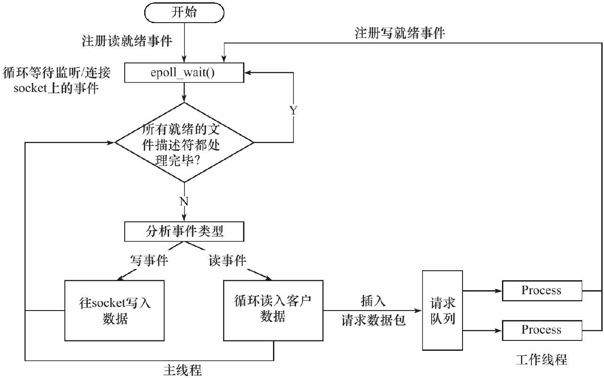

# WebServerDemo 项目整体流程

```shell
.
├── CGImysql
│   ├── sql_connection_pool.cpp
│   └── sql_connection_pool.h
├── Makefile
├── http
│   ├── http_conn.cpp
│   └── http_conn.h
├── lock
│   └── locker.h
├── log
│   ├── block_queue.h
│   ├── log.cpp
│   └── log.h
├── main.c
├── server
├── threadpool
│   └── threadpool.h
└── timer
    └── lst_timer.h
```

## 整体框架

### 服务器基本框架


在该项目中，

+ I/O 处理单元为：**主线程**处理，用于处理客户端连接，读写网络数据
  + 读：请求数据到来，epoll_wait 通知主线程，主线程读取数据，并将数据封装成**请求对象（http 类）**，插入**请求队列（双向链表实现）**
  + 写：工作线程的写就绪事件到来，epoll_wait 通知主线程
+ 请求队列：I/O 处理单元与逻辑单元之间的请求队列，**线程池类中利用链表实现**
  + 唤醒睡眠在请求队列上的工作线程
+ 逻辑单元为：**http 类**，**线程池实现（工作线程线程池）**，线程池中存放的即是 http 类
  + 工作线程从请求队列中获取到**请求对象（http 类）**
  + 解析 HTTP 请求
  + 生成响应数据
  + 往 epoll 内核事件表中注册 socket 上的写就绪事件
+ 网络存储单元为：**数据库连接池**，MySQL 存储的用户信息

### 服务器事件处理模式

该项目使用同步 I/O 方式模拟 Proactor 模式



1. 主线程往 epoll 内核事件表中注册 socket 上的读就绪事件。
2. 主线程调用 epoll_wait 等待 socket 上有数据可读。
3. 当 socket 上有数据可读时，epoll_wait 通知主线程。主线程从 socket 循环读取数据，直到没有更多数据可读，然后将读取到的数据封装成一个请求对象并插入请求队列。
4. 睡眠在请求队列上的某个工作线程被唤醒，它获得请求对象并处理客户请求，然后往 epoll 内核事
件表中注册 socket 上的写就绪事件。
5. 主线程调用 epoll_wait 等待 socket 可写。
6. 当 socket 可写时，epoll_wait 通知主线程。主线程往 socket 上写入服务器处理客户请求的结果。

## `./main.c`

+ 前期配置

  + 创建同步**日志**实例（或者异步日志）
  + 命令行参数检查：IP地址、端口参数（但是输入的 IP 地址根本没用）
  + 注册**信号**处理函数：忽略， 往读端被关闭的管道或 socket 连接中写数据
    + 【场景分析】默认行为是结束进程，当服务端往客户端发送数据，客户端关闭与服务器的连接，若不忽略该信号，会导致进程结束，这不是我们希望的。
    + 其他做法
      + 使用 `send` 函数的 `MSG_NOSIGNAL` 标志来禁止写操作触发 `SIGPIPE`，使用`send` 函数的反馈的 `errno` 值来判断管道或者 `socket` 连接的读端是是否已经关闭
      + I/O复用系统调用来检测管道和 socket 连接的读端是否已经关闭。以poll为例，当管道的读端关闭时，写端文件描述符上的POLLHUP事件被触发；当socket连接被对方关闭时，socket上的POLLRDHUP事件被触发
  + 创建**数据库连接池**并初始化：处理登录用户连接？
  + 创建**线程池**：处理客户端连接任务
  + 创建 **http 连接处理类**（`new` 动态分配的）
  + 初始化数据库

+ 网络通信流程：创建、绑定地址、监听

  + 创建监听 socket
  + 设置 socket 选项：端口重用
  + socket 绑定地址
  + 开始监听

+ 同步 I/O 模拟 Proactor 事件处理模式（设置 LT/ET）

  + 创建内核事件表
  + **监听 socket** 注册到内核事件表
  + **统一事件源**：创建管道使信号和主循环通信，使信号事件和其他 I/O 事件一样被处理
    + 注册 `pipefd[0]` 上的可读事件
    + 设置信号处理函数：闹钟或终止信号到来，通过管道发送给 epoll 注册的 `pipefd[0]` 上的可读事件
  + 关闭非活动连接
    + 创建用户连接的定时器（`new` 动态分配的）

+ （while 循环）网络通信流程：接受连接请求

  + 阻塞（超时时间设为 -1）文件描述符上的时间

  + 遍历就绪的文件描述符

    + 监听 socket 就绪，转为连接 socket

      + LT 方式下：初始化连接用户的数据，地址 / 连接 socket / 定时器
      + ET 方式下：

    + 用户关闭连接 / 挂起 / 错误 事件就绪

      服务器端关闭对应连接，并移除对应的定时器

    + 信号事件就绪：处理信号（闹钟？；ctrl + c 终止运行）

    + 客户端发送数据事件

      + 服务端读事件：**http 连接处理类** 调用函数读取浏览器发送数据，并将该连接事件放入请求队列（线程池抢任务）
      + 若有数据传输，定时器延迟

    + 客户端接收数据

      + 服务端发数据事件：**http 连接处理类** 调用函数写请求响应报文发送给浏览器
      + 若有数据传输，定时器延时

+ 资源释放

  + 关闭**内核事件表的文件描述符**
  + 关闭**监听 socke**t
  + 关闭**管道**
  + 释放 **http 连接处理类**
  + 释放**定时器**资源
  + 释放**线程池**资源
