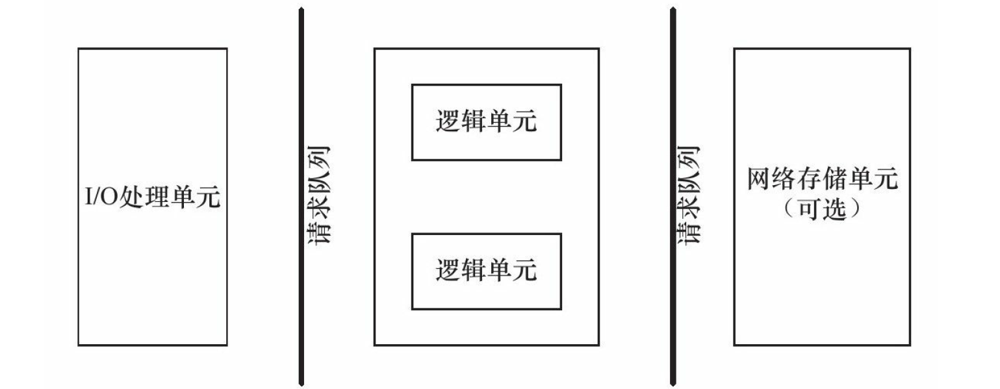

半同步/半反应堆线程池
===============
使用一个工作队列完全解除了主线程和工作线程的耦合关系：主线程往工作队列中插入任务，工作线程通过竞争来取得任务并执行它。
> * 同步I/O模拟proactor模式
> * 半同步/半反应堆
> * 线程池

## 功能



+ 线程池类实现的为上图中，逻辑单元 + 请求队列（I/O 处理单元、逻辑单元之间）
+ 请求数据到来，epoll_wait 通知主线程，主线程读取数据，并将数据封装成**请求对象（http 类）**，插入**请求队列（双向链表实现）**
+ 请求队列与逻辑单元之间，是消费者与生产者模型，请求队列为生产者，线程池为消费者

## 成员变量

+ 线程同步机制类：互斥锁、信号量，多线程从请求队列中取任务，确保任一时刻只有一个线程可以拥有对资源的独占式访问
  + 互斥锁，保证线程对任务队列的独占式访问
  + 信号量
+ 线程池：
  + 通过数组实现
  + 线程池中线程数选取，根据任务是 I/O 密集型还是 CPU 密集型来进行选取，CPU 密集型任务选取与 CPU 核数接近，I/O 密集型任务可适量多选。该项目中，线程池中线程数默认设置为 8
+ 请求队列
  + 通过双向链表实现
  + 请求队列允许的最大请求数
+ 数据库连接池指针
+ 是否结束线程标志

```c++
template <typename T>
class threadpool {
private:
    int              m_thread_number; // 线程池中的线程数
    int              m_max_requests;  // 请求队列中允许的最大请求数
    pthread_t*       m_threads;       // 描述线程池的数组，其大小为m_thread_number
    std::list<T*>    m_workqueue;     // 双线链表实现请求队列
    locker           m_queuelocker;   // 保护请求队列的互斥锁
    sem              m_queuestat;     // 是否有任务需要处理的信号量
    bool             m_stop;          // 是否结束线程
    connection_pool* m_connPool;      // 数据库连接池指针
};
```

## 成员函数

+ **构造函数**
  + 功能：
    + 动态分配线程池资源（数组）；
    + 并对数组元素循环创建线程（用户设置的数组大小，即线程池中的线程数）；
    + 创建的线程进行线程分离，由系统回收资源
  + 用户输入：
    + 数据库连接池指针
    + 线程池中的线程数
    + 请求队列中允许的最大请求数
+ **析构函数**
  + 构造函数里通过 new 创建的线程池数组，在析构函数中通过 delete 释放
  + 并将线程是否结束标志置为 false
+ **插入请求**
  + （加锁判断）判断请求队列内请求数（即队列内元素个数）是否大于最大请求数；
  + 插入新的请求任务至任务队列；
  + 信号量 +1
+ **线程池工作函数（private、静态）**
  + 调用运行函数
+ **运行函数（private）**
  + 检查状态：是否结束线程
  + 等待信号量，判断请求队列是否为空
  + 从任务队列取任务，任务队列删除已被取出任务
  + 从数据库连接池获取连接
  + 处理业务逻辑

## Reference

+ https://mp.weixin.qq.com/s/RstyU1XpthItvWvSQ1EbiQ


