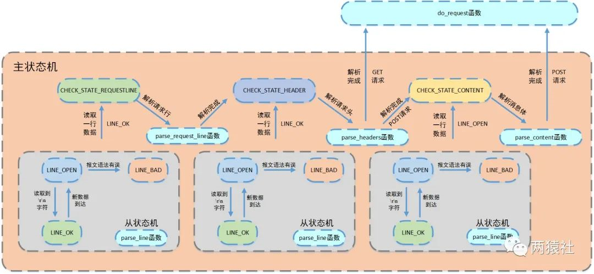
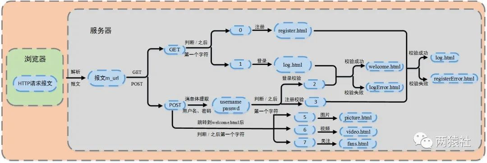

http连接处理类
===============
根据状态转移,通过主从状态机封装了http连接类。其中,主状态机在内部调用从状态机,从状态机将处理状态和数据传给主状态机
> * 客户端发出http连接请求
> * 从状态机读取数据,更新自身状态和接收数据,传给主状态机
> * 主状态机根据从状态机状态,更新自身状态,决定响应请求还是继续读取





## 功能介绍

+ 将客户端发送的 http 请求封装成类
+ 在主线程中，将注册了监听套接字的 `epollfd` 赋值给 **http 类对象**的 `m_epollfd`（静态成员变量）
+ 新到的客户连接事件到来后，接受连接，生成连接套接字，通过连接套接字和客户端地址初始化 **http 类对象**
+ 客户连接发送数据事件到来后，**http 类对象**去读，并将其放入请求队列

## 成员变量

```c++
class http_conn {
public:
    static const int FILENAME_LEN = 200;       // 设置读取文件的名称 m_real_file 大小
    static const int READ_BUFFER_SIZE = 2048;  // 设置读缓冲区 m_read_buf 大小
    static const int WRITE_BUFFER_SIZE = 1024; // 设置写缓冲区 m_write_buf 大小
    enum METHOD {};      // 请求方法
    enum CHECK_STATE {}; // 主状态机状态
    enum HTTP_CODE {};   // HTTP 请求的结果
    enum LINE_STATUS {}; // 从状态机状态
    
public:
    static int m_epollfd;
    static int m_user_count;
    MYSQL*     mysql;

private:
    int         m_sockfd;
    sockaddr_in m_address;

    // 存储读取的请求报文数据
    char m_read_buf[READ_BUFFER_SIZE];

    // 缓冲区中m_read_buf中数据的最后一个字节的下一个位置
    int m_read_idx;

    // m_read_buf读取的位置m_checked_idx
    int m_checked_idx;

    // m_read_buf中已经解析的字符个数
    int m_start_line;

    // 存储发出的响应报文数据
    char m_write_buf[WRITE_BUFFER_SIZE];

    // 指示buffer中的长度
    int m_write_idx;

    // 主状态机的状态
    CHECK_STATE m_check_state;

    // 请求方法
    METHOD m_method;

    // 以下为解析请求报文中对应的6个变量
    char  m_real_file[FILENAME_LEN]; // 存储读取文件的名称
    char* m_url;
    char* m_version;
    char* m_host;
    int   m_content_length;
    bool  m_linger;

    char*       m_file_address; // 读取服务器上的文件地址
    struct stat m_file_stat;

    struct iovec m_iv[2]; // io向量机制iovec
    int          m_iv_count;
    int          cgi;             // 是否启用的  POST
    char*        m_string;        // 存储请求头数据
    int          bytes_to_send;   // 剩余发送字节数
    int          bytes_have_send; // 已发送字节数
};
```

## 成员函数

+ 初始化
  + 连接请求到来后，accept 生成 连接套接字，利用该**连接套接字**初始化 **http 类对象**
  + 初始化客户端连接套接字、客户端地址
  + 将该连接套接字注册到 `epollfd` 监听事件
  + 用户数量 +1
  + 调用初始化函数（private）
+ 读取请求数据
  + 从初始化中获取的**连接套接字**中读取数据
  + ET 模式下需在 while 循环内读完
+ 报文解析
  + 调用报文解析函数（private）
+ 写响应报文（多块分散内存一并写入文件描述符）
  + 检查发送数据的长度
  + while 循环中发送数据
    + 将响应报文的状态行、消息头、空行和响应正文写入文件描述符（状态行、头部字段、空行放在同一块内存，响应正文/文档 通常被读入到另一块内存（通过 mmap 函数）），不需对内容拼接发送，而是使用 `writev` 函数
    + 更新已发送字节数、待发送字节数

+ 初始化数据库读取表
  + 输入：连接池类
  + 从连接池取连接
  + 从数据库表中检索数据
  + 检索结果存入 `map` （用户名，密码）
+ 关闭 http 连接
  + 将连接套接字从 epoll 监听事件中移除
  + 用户数 -1 

