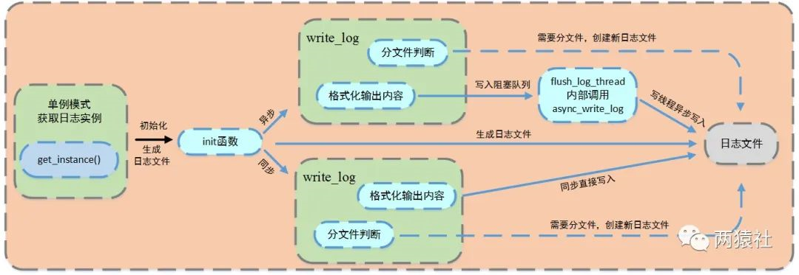

同步/异步日志系统
===============
同步/异步日志系统主要涉及了两个模块，一个是日志模块，一个是阻塞队列模块,其中加入阻塞队列模块主要是解决异步写入日志做准备.
> * 自定义阻塞队列
> * 单例模式创建日志
> * 同步日志
> * 异步日志
> * 实现按天、超行分类



## Table of Contents

+ [Basis](#basis)
+ [Singleton](#singleton)
+ [Producer-Consumer](#Producer-Consumer)
+ [Block Queue](#block queue)
+ [Reference](#reference)

## Basis

+ **日志：**由服务器自动创建，并记录运行状态，错误信息，访问数据的文件。
+ **同步日志：**日志写入函数与工作线程串行执行，由于涉及到I/O操作，当单条日志比较大的时候，同步模式会阻塞整个处理流程，服务器所能处理的并发能力将有所下降，尤其是在峰值的时候，写日志可能成为系统的瓶颈。
+ **异步日志：**将所写的日志内容先存入阻塞队列，写线程从阻塞队列中取出内容，写入日志。
+ **阻塞队列：**将生产者-消费者模型进行封装，使用循环数组实现队列，作为两者共享的缓冲区。

## Singleton

+ 概念：单例模式，一种设计模式，保证一个类仅有一个实例，并提供一个访问它的全局访问点，该实例被所有程序模块共享。

+ 实现思路：

  + 私有化构造函数，以防止外界创建单例类的对象
  + 使用类的私有静态指针变量指向类的唯一实例，并用一个公有的静态方法获取该实例

+ 实现方法

  + 懒汉模式：延迟实例化，在第一次被使用时才进行初始化
  + 饿汉模式：急切实例化，程序运行时立即初始化

+ 懒汉模式

  + 双检测锁

    ```c++
    #include <memory>
    #include <mutex>
    using namespace std;
    class Single {
    public:
    	Single(Single&) = delete;
    	Single& operator=(const Single&) = delete;
    
        // 公有静态方法获取实例
    	static Single* getInstance() {
    		if (ptr_ == nullptr) {
    			lock_guard<mutex> locker(mutex_);
    			if (ptr_ == nullptr) {
    				ptr_ = new Single;
    			}
    		}
    		return ptr_;
    	}
    
    private:
        
        // 私有化构造函数
        Single() { cout << "Single()" << endl; }
    	~Single() { cout << "~Single()" << endl; }
    	
    	static Single* ptr_;  // 私有静态指针变量指向唯一实例
    	static mutex mutex_;  // 静态锁, 因为静态函数只能访问静态成员
    };
    
    Single* Single::ptr_ = nullptr;
    mutex Single::mutex_;
    ```

  + 局部静态变量(C++11)

    c++11 要求编译器保证内部静态变量的线程安全性

    ```c++
    class Single {
    private:
    	Single() {}
    	~Single() {}
    public:
    	static Single* getinstance();
    };
    
    Single* Single::getinstance() {
    	static Single obj;
    	return &obj;
    }
    ```

+ 饿汉模式

  在程序运行时就定义并对其初始化，故不需要锁就可以实现线程安全。

  隐藏问题：函数外的 `static` 对象在不同编译单元中的初始化顺序是未定义的，如果在初始化完成前调用 `getInstance()` 方法会返回一个未定义的实例。

  ```c++
  class Single {
  private:
  	Single() {}
  	~Single() {}
  	static Single* p;
  public:
  	static Single* getinstance();
  };
  
  Single* Single::p = new Single();
  
  Single* Single::getinstance() {
  	return p;
  }

## Producer-Consumer

+ 概念
  + 互斥：生产者、消费者对缓冲区访问互斥
  + 协作与同步：只有生产者生产之后，消费者才能消费

+ 实现：使用阻塞队列，生产者往队列 push 成员，消费者从队列中 pop 成员

## Block Queue

使用循环数组实现阻塞队列，作为生产者和消费者的的共享缓冲区

## Reference

+ https://mp.weixin.qq.com/s/IWAlPzVDkR2ZRI5iirEfCg
+ [日志系统](https://blog.csdn.net/weixin_46778443/article/details/124020992)
+ [单例模式](https://blog.csdn.net/u010001838/article/details/44649609)
