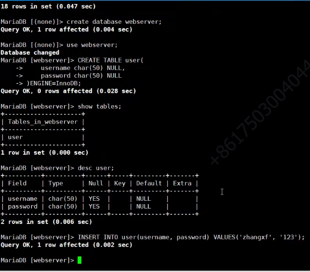
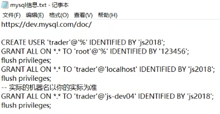

## 小方说服务器 0312

面试题：

+ select 函数的基本用法
  + 参数设置
  + 阻塞相关
  + 模拟 sleep

基本功能

代码风格

+ 向前引用？
+ vx 插件

简历如何描述

+ WebServer

  + mysql 相关问题

    + -lmysql export
    + bash_profile

  + Makefile 问题

    + 编译
    + clean
    + `-lpthread -lmysql`
    + `-L/usr/lib64/mysql -lmysql` 寻找库的路径
    + 正常编译、debug 编译两套makefile
    + 尽量不要有 warning
    + `ps x | grep 32618` 
    + `lsof`
    + `ctrl + c` 中断程序运行
    + `ctrl + z` 挂到后台
    + `job` `fg` `bg`

  + bug

    + 程序错误，不要用断言，直接用 return

  + gdb 调试

    + `cgdb server `
    + `b HttpResponse::Init` 命令加断点
    + `n` 单步调试
    + `p [变量]` 查看值
    + `shell ls` 执行 shell 命令
    + `bt` 查看堆栈 `s`  `i` 输入命令行，f4 跳转
    + 函数(参数， 参数) 输入参数放在前面，输出参数放在后面
    + `s` 进函数

  + 注意点

    + main 要写返回值
    + 参数定义为宏或常量
    + 不要用assert
    + if else，短的条件写在前面（if 条件取反），后面就不用else了
    + 端口号直接定义 uint6_t，不用设为 int
    + 不用对监听套接字设置优雅关闭
    + RAII 封装 socket，构造，析构自动关闭
    + 配置后就创建日志，后面出错都可以用
    + one thread one loop
    + 熟悉 ulimit
    + 红黑树、哈希表
    + 处理 sigpipe，默认会中断进程，应该忽略该信号或者send 返回sigpipe错误码去处理错误码
    + bug，多个线程里同时对一个socket读写

  + 数据库

    

    + `mysql -hlocalhost -uroot -proot -P3306`

    + 在一台服务器运行，数据库配置在另一台服务器

    + 数据库赋权

      

## C++ 部分

+ 类的静态成员作用

  [简述静态数据成员的主要应用](https://blog.csdn.net/swint_er/article/details/123456721)

  实现一个类的多个对象之间的数据共享

+ test

+ 

  